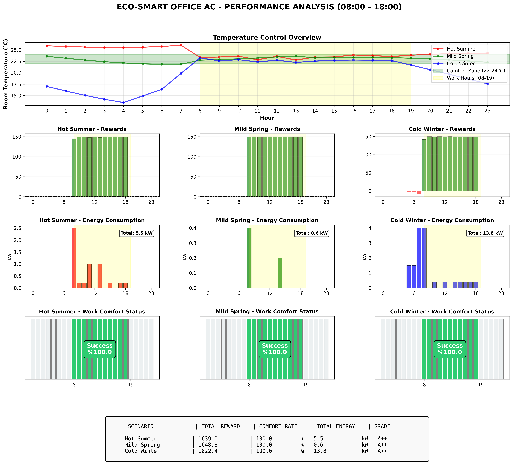
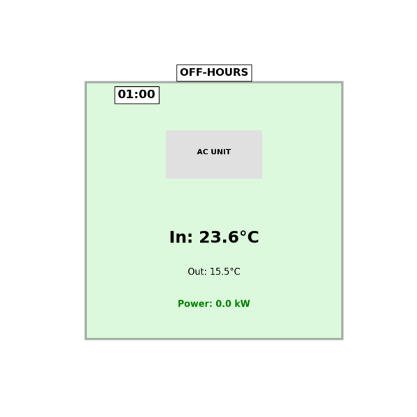
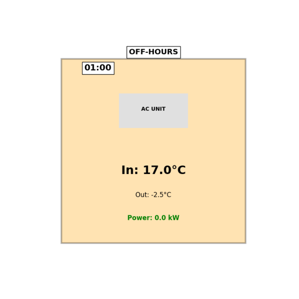

# Smart Office AC System - Q-Learning (Eco-Smart Mode)

Bir önceki projemden [Taxi-env](https://github.com/elifylmaz/Taxi-QLearning) yola çıkarak farklı bir problemi ele aldım ve geliştirdim.

## 1. Giriş

Bu çalışmada bir ofis binasındaki akıllı klima sistemini optimize etmeyi hedefledim. Sistem, 24 saatlik bir gün boyunca iç ve dış sıcaklığı takip ederek en uygun klima ayarlarını öğreniyor. Action Masking kullanmadan geliştirdiğim bu ikinci versiyonda toplamda **8.976** adet durum (state) bulunuyor. 200.000 episode süren eğitim sonucunda ajan, **%90.9 konfor oranı** ile ortalama **7.0 kW** enerji tüketimi elde etmeyi başardı.

## 2. Ortam Tasarımı

### Sistem Özellikleri

Tasarladığım akıllı klima sistemini şu şekilde kurguladım:

**Konfor Aralığı:** 22-24°C (Mesai saatlerinde hedeflenen sıcaklık)

**Mesai Saatleri:** 08:00-19:00 (11 saatlik çalışma)

**Sıcaklık Ayrıklaştırma (Discretization):**

- İç Mekan: 17 farklı aralık (15°C - 30°C arası)
```python
self.bins_room = np.array([15, 17, 19, 20, 21, 21.5, 22, 22.5, 23, 23.5, 24, 24.5, 25, 26, 28, 30])
```
- Dış Mekan: 22 farklı aralık (-10°C - 40°C arası)
```python
self.bins_outside = np.array([-10, -5, 0, 3, 6, 9, 12, 14, 16, 18, 20, 22, 24, 26, 28, 30, 32, 34, 36, 38, 40])
```

**Zaman Periyotları:** 24 saatlik gün, saatlik takip yapılıyor (0-23 arası)

**Dinamik Yapı:** Her reset işleminde iç ve dış sıcaklık rastgele belirleniyor.

**Fizik Simülasyonu:** Dış hava ile iç mekan arasında ısı transferi simüle ediliyor (transfer katsayısı: 0.05).

### Aksiyonlar (7 Adet)

Ajanın yapabileceği klima ayarlarını şu şekilde tanımladım:

- **0:** OFF (Kapalı) → 0.0°C değişim
- **1:** Cool-Low (Düşük Soğutma) → -0.5°C
- **2:** Cool-Mid (Orta Soğutma) → -1.5°C
- **3:** Cool-High (Yüksek Soğutma) → -3.0°C
- **4:** Heat-Low (Düşük Isıtma) → +0.8°C
- **5:** Heat-Mid (Orta Isıtma) → +2.0°C
- **6:** Heat-High (Yüksek Isıtma) → +4.0°C

### Enerji Tüketimi

Her aksiyonun enerji maliyetini şöyle belirledim:

- **OFF:** 0.0 kW
- **Cool-Low (1):** 0.2 kW
- **Cool-Mid (2):** 1.0 kW
- **Cool-High (3):** 2.5 kW
- **Heat-Low (4):** 0.4 kW
- **Heat-Mid (5):** 1.5 kW
- **Heat-High (6):** 4.0 kW

### Ödül Mekanizması

Sistemi optimize etmek için dengeli bir ödül yapısı kurguladım:

**Enerji Cezası (Her Adım):**
- Tüketilen enerji × 2.0 kadar ödülden düşülür

**Mesai Saatleri (08:00-19:00):**
- Konfor aralığındayken: +150 ödül
- Konfor dışındayken: -100 - (mesafe × 20) ceza
- Mesafe: Konfor aralığının sınırlarına olan minimum uzaklık

**Ekstrem Sıcaklık Koruması:**
- Sıcaklık <10°C veya >35°C ise: -50 ek ceza

**Çalışma Mantığı:**
Bu ödül yapısı sayesinde ajan şunları öğreniyor:
1. Mesai saatlerinde konfor aralığında kalmak en karlı
2. Gereksiz enerji tüketiminden kaçınmak önemli
3. Mesai dışı saatlerde sistemi kapalı tutmak mantıklı
4. Ekstrem sıcaklıklara ulaşmadan müdahale etmek gerekli

## 3. Durum Uzayı (State Space)

Durum uzayını hesaplarken şu yapıyı kullandım:

- **İç Sıcaklık İndeksi:** 17 olası değer (bins_room)
- **Dış Sıcaklık İndeksi:** 22 olası değer (bins_outside)
- **Saat Bilgisi:** 24 olası değer (0-23 arası)

**Toplam Durum Sayısı:**

17 × 22 × 24 = **8.976 Durum**

## 4. Yöntem
- **Algoritma:** Problem çözümü için **Q-Learning** algoritmasını kullandım.
- **Hiperparametreler:**
  - **Öğrenme Oranı (α):** 0.1
  - **İndirim Faktörü (γ):** 0.995 
  - **Başlangıç Keşif Oranı (ε):** 1.0
  - **Epsilon Azalma:** 0.99996 
  - **Minimum Epsilon:** 0.01
- **Eğitim Süreci:**
  - Toplamda **200.000 episod** boyunca eğitim gerçekleştirdim.
  - **3 farklı hava durumu senaryosu** üzerinde eğitim yaptım.
  - Gelişimi takip edebilmek adına her 4.000 episodda bir performans değerlendirmesi yaptım.
  - Değerlendirme metriklerim: Konfor Oranı (%), Enerji Tüketimi (kW), Ortalama Ödül
- Elde ettiğim en başarılı politikayı **`best_q_table.npy`** dosyasına kaydederek sakladım.

## 5. Geliştirme Süreci

Projeyi 4 temel adımda kurguladım ve uyguladım:

### 5.1. Ortamı (Environment) Oluşturdum

İlk iş olarak ofis sistemini ve kurallarını tanımladım.

- **`__init__`:** Konfor aralığını (22-24°C), mesai saatlerini (08:00-19:00), sıcaklık binlerini, aksiyon etkilerini ve enerji maliyetlerini burada belirledim.
- **`reset`:** Her yeni simülasyonda iç/dış sıcaklıkları rastgele atayarak (18-28°C iç, 10-30°C dış) ortamı sıfırlayan fonksiyon.
- **`_get_obs`:** Ajanın karar verebilmesi için sıcaklık indekslerini ve saat bilgisini döndürüyor.
- **`step`:** Ajanın seçtiği aksiyonu uygulayıp fizik simülasyonunu çalıştıran, ödülü hesaplayan ana fonksiyon. Dış hava etkisi ile sıcaklık değişimini simüle ediyor.
- **`render`:** Ofis durumunu, klima çalışmasını ve sıcaklık bilgilerini görselleştirdiğim kısım. Mesai saati ve konfor durumuna göre arka plan rengi değişiyor.

### 5.2. Rastgele Baseline Testi

Ajanın henüz hiçbir şey öğrenmeden ortamda nasıl davrandığını görmek istedim.

- **3 Senaryo Tanımladım:**
  - **Hot Summer:** 24-38°C arası değişen aşırı sıcak gün
  - **Mild Spring:** 15-28°C arası ılıman bahar günü
  - **Cold Winter:** -3°C ile 14°C arası soğuk kış günü
- **`run_random_scenario`:** Ajan tamamen rastgele aksiyonlarla 24 saatlik bir günü simüle etti.

### 5.3. Q-Learning Eğitimi Gerçekleştirdim

Ajanı Q-Learning algoritması ile eğittim:

- **Hazırlık:** Boş bir Q-Tablosu (8.976 × 7) oluşturdum ve hiperparametreleri ayarladım.
- **Eğitim Döngüsü:** Ajana 24 saatlik günü tam 200.000 kez oynattım.
- **Senaryo Rotasyonu:** Her episodda 3 senaryo arasında dönüşümlü geçiş yaparak çeşitlilik sağladım.
- **Epsilon-Greedy:** Ajanın başlangıçta çok keşif yapmasını (ε=1.0), zamanla bildiği en iyi hamleyi yapmasını sağladım.
- **Kayıt Mantığı:** Her 4.000 episodda 3 senaryo üzerinde ortalama performans ölçtüm. Eğer konfor oranı rekor kırarsa veya aynı konfor ile daha az enerji tüketiyorsa modeli `best_q_table.npy` olarak kaydettim.
- **Sonuçları Görselleştirdim:** Ödül ve konfor grafiklerini 5'li hareketli ortalama ile düzgünleştirerek çizdim.

### 5.4. Best Q-Table ile Test ve Detaylı Analiz

Son aşamada eğitilmiş modeli test ettim:

- Kaydettiğim "en iyi modeli" yükleyerek 3 senaryo üzerinde detaylı test ettim.
- Bu aşamada ajan artık keşif yapmadı doğrudan öğrendiği optimal politikayı uyguladı.
- **Detaylı Dashboard:** 
  - Tüm senaryoların sıcaklık kontrol grafiği
  - Her senaryo için saatlik ödül dağılımı (3 grafik)
  - Her senaryo için enerji tüketim grafiği (3 grafik)
  - Her senaryo için mesai saati konfor başarı durumu (3 grafik)
  - Genel özet rapor kartı (tablo)
- Animasyonları GIF olarak kaydedip görselleştirdim.

## 6. Eğitim Sonuçları

Eğitim sürecinden elde ettiğim veriler aşağıdaki gibidir:

| Episode | Epsilon | Konfor (%) | Enerji (kW) | Ödül | Durum |
|:--------|:--------|:-----------|:------------|:-----|:------|
| 4.000 | 0.852 | 90.9 | 8.1 | 1633.7 | İlk Rekor |
| 8.000 | 0.726 | 90.9 | 8.0 | 1634.1 | Enerji ↓ |
| 20.000 | 0.449 | 90.9 | 7.6 | 1634.7 | Enerji ↓ |
| 24.000 | 0.383 | 90.9 | 7.4 | 1635.1 | Enerji ↓ |
| **32.000** | **0.278** | **90.9** | **7.0** | **1636.0** | **EN İYİ** |
| 40.000+ | 0.202 → 0.010 | 90.9 / 87.9 | 6.8 - 7.7 | 1535-1636 | Stabil |
| 200.000 | 0.010 | 87.9 | 7.1 | 1551.3 | Final |


**Analiz:**

Sonuçları incelediğimde, ajanın **ilk 10.000 episodda** %90'a ulaştığını gördüm. Performansın zirveye ulaştığı nokta ise **32.000 episod** oldu. Bu noktada ajan **%90.9 konfor** sağlarken sadece **7.0 kW** enerji tüketti. Daha sonraki episodlarda performans %87.9 ile %90.9 arasında stabil kaldı, bu da politikanın güvenilir şekilde öğrenildiğini gösteriyor.

Toplam eğitim süresi: **3.7 dakika** sürdü.

## 7. Test Sonuçları

Eğittiğim modeli 3 farklı senaryo üzerinde test ettiğimde şu sonuçları aldım:

### Genel Performans Özeti

| Senaryo | Konfor Oranı | Toplam Ödül | Enerji Tüketimi | Not |
|:--------|:-------------|:------------|:----------------|:----|
| **Hot Summer** | %100.0 (11/11 saat) | 1639.0 | 5.5 kW | A++ |
| **Mild Spring** | %100.0 (11/11 saat) | 1648.8 | 0.6 kW | A++ |
| **Cold Winter** | %100.0 (11/11 saat) | 1622.4 | 13.8 kW | A++ |




**Değerlendirme:**

Test aşamasında ajanın **3 farklı hava durumunda da mükemmel performans** gösterdiğini gözlemledim. En önemlisi, senaryo zorluğuna göre enerji tüketimini akıllıca ölçeklendirdi: ılıman havada minimal (0.6 kW), aşırı sıcakta orta (5.5 kW), aşırı soğukta maksimum (13.8 kW) enerji harcadı. Tüm senaryolarda **mesai dışı saatlerde sistemi kapatarak** gereksiz enerji tüketiminden kaçındı ve **%100 konfor oranı** elde etti.

**Test Episode Animasyonları:**

<p align="center">
  
  
</p>
<p align="center">
  
</p>

