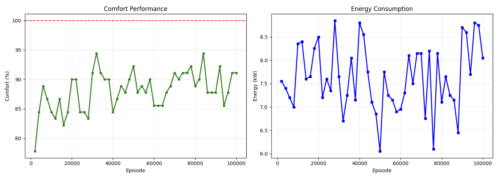
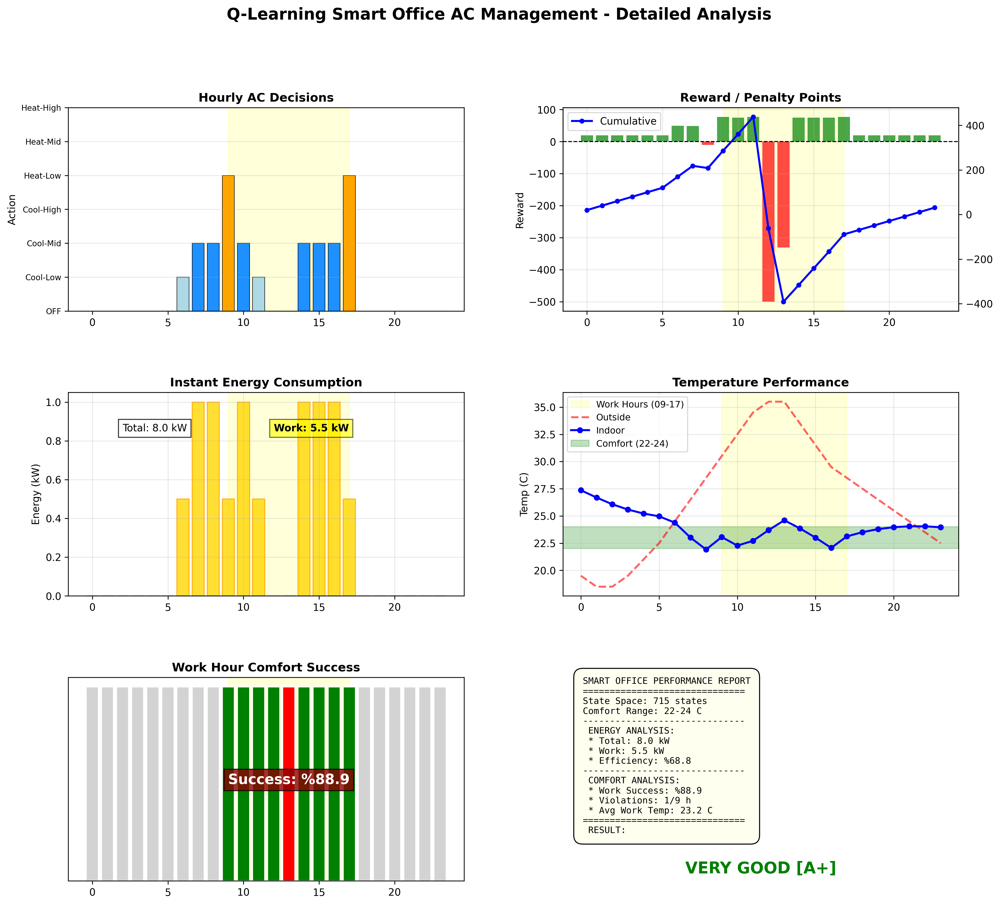
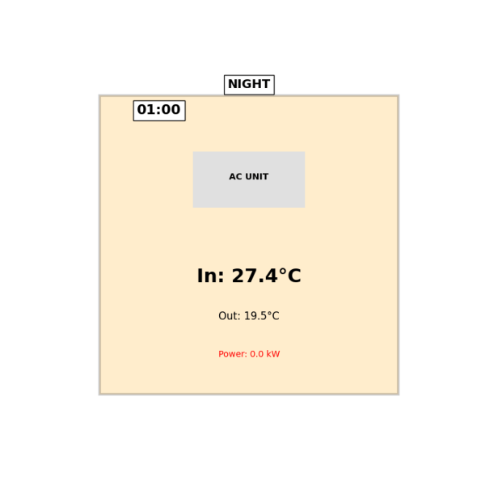

# Smart Office AC System - Q-Learning

Bir önceki projemden[Taxi-env](https://github.com/elifylmaz/Taxi-QLearning) yola çıkarak farklı bir problemi ele aldım. 

## 1. Giriş

Bu çalışmada bir ofis binasındaki akıllı klima sistemini optimize etmeyi hedefledim. Sistem, 24 saatlik bir gün boyunca iç ve dış sıcaklığı takip ederek en uygun klima ayarlarını öğreniyor. Action Masking kullanmadan geliştirdiğim projede toplamda **715** adet durum (state) bulunuyor. 100.000 episode süren eğitim sonucunda ajan, %94.4 konfor oranı ile ortalama 6.7 kW enerji tüketimi elde etmeyi başardı.

## 2. Ortam Tasarımı

### Sistem Özellikleri

Tasarladığım akıllı klima sistemini şu şekilde kurguladım:

**Konfor Aralığı:** 22-24°C (Mesai saatlerinde hedeflenen sıcaklık)

**Sıcaklık Ayrıklaştırma (Discretization):**

- İç Mekan: 13 farklı aralık (15°C - 30°C arası)
```
self.bins_room = np.array([15, 18, 20, 21, 22, 23, 23.5, 24, 25, 26, 28, 30])
```
- Dış Mekan: 11 farklı aralık (-5°C - 40°C arası)
```
self.bins_outside = np.array([-5, 0, 5, 10, 15, 20, 25, 30, 35, 40])
```

**Zaman Periyotları:** 24 saatlik gün, 4 zaman dilimine ayrıldı:
- Gece (00:00-05:00)
- Hazırlık (06:00-08:00)
- Mesai (09:00-17:00)
- Akşam (18:00-23:00)

**Dinamik Yapı:** Her reset işleminde iç ve dış sıcaklık rastgele belirleniyor.

**Fizik Simülasyonu:** Dış hava ile iç mekan arasında ısı transferi simüle ediliyor.

### Aksiyonlar (7 Adet)

Ajanın yapabileceği klima ayarlarını şu şekilde tanımladım:

- **0:** OFF (Kapalı)
- **1:** Cool-Low (Düşük Soğutma) → -0.5°C
- **2:** Cool-Mid (Orta Soğutma) → -1.5°C
- **3:** Cool-High (Yüksek Soğutma) → -3.0°C
- **4:** Heat-Low (Düşük Isıtma) → +0.5°C
- **5:** Heat-Mid (Orta Isıtma) → +1.5°C
- **6:** Heat-High (Yüksek Isıtma) → +3.0°C

### Enerji Tüketimi

Her aksiyonun enerji maliyetini şöyle belirledim:

- **OFF:** 0.0 kW
- **Low (1, 4):** 0.5 kW
- **Mid (2, 5):** 1.0 kW
- **High (3, 6):** 2.0 kW

### Ödül Mekanizması

Sistemi optimize etmek için karmaşık bir ödül yapısı kurguladım:

**Mesai Saatleri (09:00-17:00):**
- Konfor aralığındayken OFF: +100 (Enerji tasarrufu)
- Konfor aralığında diğer aksiyonlar: +80 - (maliyet × 5)
- Özel koruma (Noon Shield): 11:00-16:00 arası sıcaklık >22.8°C ise OFF: -500 (Kritik)
- Normal saatlerde >23.5°C ise OFF: -100
- Konfor dışında OFF: -300 ek ceza
- Konfor dışında uzaklık bazlı ceza: mesafe × 50

**Hazırlık Saatleri (06:00-08:00):**
- Hedef: <23.0°C'ye düşürmek
- >23.0°C iken OFF: -200
- >23.0°C iken ısıtma: -500 (Mantıksız)
- Hedefe ulaşıldıysa OFF: +20
- Gereksiz işlem: -(maliyet × 10)

**Kısıtlı Bölgeler (Gece & Akşam):**
- OFF: +20
- Diğer tüm aksiyonlar: -200 (Yasak)

## 3. Durum Uzayı (State Space)

Durum uzayını hesaplarken şu yapıyı kullandım:

- **İç Sıcaklık İndeksi:** 13 olası değer (bins_room)
- **Dış Sıcaklık İndeksi:** 11 olası değer (bins_outside)
- **Zaman Periyodu:** 5 olası değer (0: Gece, 1: Hazırlık, 2: Mesai, 3: Akşam, 4: Yedek)

**Toplam Durum Sayısı:**

13 × 11 × 5 = **715 Durum**

Bu kompakt durum uzayı sayesinde hızlı bir öğrenme süreci elde ettim.

## 4. Yöntem

Projeyi hayata geçirirken izlediğim yöntem ve belirlediğim parametreler şunlardır:

- **Algoritma:** Problem çözümü için **Q-Learning** algoritmasını kullandım.
- **Hiperparametreler:**
  - **Öğrenme Oranı (α):** 0.1
  - **İndirim Faktörü (γ):** 0.99
  - **Başlangıç Keşif Oranı (ε):** 1.0
  - **Epsilon Azalma:** 0.9999 (her adımda)
  - **Minimum Epsilon:** 0.01
- **Eğitim Süreci:**
  - Toplamda **100.000 episod** boyunca eğitim gerçekleştirdim.
  - Gelişimi takip edebilmek adına her 2.000 episodda bir performans değerlendirmesi yaptım.
  - Değerlendirme metriklerim: Konfor Oranı (%), Enerji Tüketimi (kW), Ortalama Ödül
- Elde ettiğim en başarılı politikayı (policy) **`best_q_table.npy`** dosyasına kaydederek sakladım.

## 5. Geliştirme Süreci

Projeyi 5 temel adımda kurguladım ve uyguladım:

### 5.1. Ortamı (Environment) Oluşturdum

İlk iş olarak akıllı ofis sisteminin dünyasını ve kurallarını tanımladım.

- **`__init__`:** Konfor aralığını, sıcaklık binlerini, aksiyon etkilerini ve enerji maliyetlerini burada belirledim.
- **`reset`:** Her yeni simülasyonda iç/dış sıcaklıkları rastgele atayarak ortamı sıfırlayan fonksiyon.
- **`_get_obs`:** Ajanın karar verebilmesi için sıcaklık indekslerini ve zaman periyodunu döndürüyor.
- **`_get_time_period`:** Saati alıp hangi zaman diliminde olduğumuzu hesaplayan yardımcı fonksiyon.
- **`step`:** Ajanın seçtiği aksiyonu uygulayıp fizik simülasyonunu çalıştıran, ödülü hesaplayan ana fonksiyon.
- **`render`:** Ofis durumunu, klima çalışmasını ve sıcaklık bilgilerini görselleştirdiğim kısım.

### 5.2. State ve Action Kontrollerini Sağladım

Kodun sağlıklı çalışıp çalışmadığını test etmek için bir doğrulama adımı ekledim.

- Ortamı başlatıp rastgele hamleler yaptırarak sistemin tepkisini gözlemledim.
- Ödül mekanizmasının ve sıcaklık değişimlerinin mantıklı işleyip işlemediğini teyit ettim.
- Q-tablosunda veriyi işleyebilmek adına, gözlem durumunu (observation) benzersiz bir sayıya çeviren `state_to_index` fonksiyonunu yazdım.

### 5.3. Rastgele Bir Episode Çalıştırıp Gözlemledim

Ajanın henüz hiçbir şey öğrenmeden ortamda nasıl davrandığını görmek istedim.

- **`run_random_scenario`:** Ajan tamamen rastgele aksiyonlarla 24 saatlik bir günü simüle etti.
- Standart yaz günü sıcaklık profili kullandım (sabah serin, öğlen çok sıcak, akşam soğuyor).
- Sonuç: %11.1 konfor oranı, -4814.9 toplam ödül → Eğitim gerekli!
- **`show_animation`:** Kareleri birleştirerek görsel animasyon oluşturdum.

### 5.4. Q-Learning Eğitimi Gerçekleştirdim

Ajanı Q-Learning algoritması ile eğittim:

- **Hazırlık:** Boş bir Q-Tablosu (715 × 7) oluşturdum ve hiperparametreleri ayarladım.
- **Eğitim Döngüsü:** Ajana 24 saatlik günü tam 100.000 kez oynattım.
- **Epsilon-Greedy:** Ajanın başlangıçta çok keşif yapmasını (ε=1.0), zamanla bildiği en iyi hamleyi yapmasını (ε→0.01) sağladım.
- **Kayıt Mantığı:** Her 2.000 episodda performans ölçtüm. Eğer konfor oranı rekor kırarsa veya aynı konfor ile daha az enerji tüketiyorsa modeli `best_q_table.npy` olarak kaydettim.
- **Sonuçları Görselleştirdim:** Konfor ve enerji grafiklerini çizdim.

### 5.5. Best Q-Table ile Test ve Detaylı Analiz

Son aşama.

- Kaydettiğim "en iyi modeli" yükleyerek standart yaz günü senaryosunda test ettim.
- Bu aşamada ajan artık keşif yapmadı (ε=0), doğrudan öğrendiği optimal politikayı uyguladı.
- **Detaylı Dashboard:** 6 farklı grafikle performansı analiz ettim:
  - Saatlik Karar Geçmişi
  - Ödül/Ceza Dağılımı
  - Enerji Tüketimi
  - Sıcaklık Performansı
  - Mesai Saati Konfor Başarısı
  - Genel Rapor Kartı
- Animasyonu GIF olarak kaydedip görselleştirdim.

## 6. Eğitim Sonuçları

Eğitim sürecinden elde ettiğim veriler aşağıdaki gibidir:

| Episode | Epsilon | Konfor (%) | Enerji (kW) | Ödül | Durum |
|:--------|:--------|:-----------|:------------|:-----|:------|
| 2.000 | 0.819 | 77.8 | 7.5 | 866.9 | İlk Rekor |
| 4.000 | 0.670 | 84.4 | 7.4 | 915.9 | Konfor ↑ |
| 6.000 | 0.549 | 88.9 | 7.2 | 935.6 | Konfor ↑ |
| 20.000 | 0.135 | 90.0 | 8.5 | 891.1 | %90 Geçti |
| 22.000 | 0.111 | 90.0 | 7.2 | 948.1 | Enerji ↓ |
| 30.000 | 0.050 | 91.1 | 7.7 | 931.3 | Konfor ↑ |
| 32.000 | 0.041 | **94.4** | **6.7** | **995.5** | **EN İYİ** |
| 100.000 | 0.010 | 91.1 | 8.1 | 907.3 | Final |

**Analiz:**

Sonuçları incelediğimde, ajanın yaklaşık **30.000** episod civarında %90'ın üzerine çıktığını gördüm. Performansın zirveye ulaştığı nokta ise **32.000** episod oldu. Bu noktada ajan **%94.4 konfor** sağlarken sadece **6.7 kW** enerji tüketti.

Toplam eğitim süresi: **1.2 dakika** sürdü.



## 7. Test Sonuçları

Eğittiğim modeli standart yaz günü senaryosunda test ettiğimde şu sonuçları aldım:

### Genel Performans

| Metrik | Değer |
|:-------|:------|
| Mesai Saati Konfor Başarısı | %88.9 (8/9 saat) |
| Toplam Enerji Tüketimi | 8.0 kW |
| Mesai Saati Enerji | 5.5 kW (%68.4) |
| Ortalama Mesai Sıcaklığı | 23.2°C |
| İhlal Sayısı | 1/9 saat |

### Saatlik Performans Özeti

**Gece (00:00-05:00):** Sistem kapalı, doğal soğuma → Enerji: 0.0 kW

**Hazırlık (06:00-08:00):** Aktif soğutma, mesai için hazırlık → Enerji: 2.5 kW

**Mesai (09:00-17:00):** 
- 09:00: Hafif düşük (21.9°C), ısıtma yapıldı
- 10:00-13:00: Konfor aralığında, akıllı kapalı/açık stratejisi
- 14:00: Tek ihlal (24.6°C), hemen müdahale
- 15:00-17:00: Konfor aralığına dönüş
- Enerji: 5.5 kW

**Akşam (18:00-23:00):** Sistem kapalı, doğal soğuma → Enerji: 0.0 kW



**Değerlendirme:**

Test aşamasında ajanın **mesai saatlerinde enerji tasarrufu yaptığını**, kritik sıcaklık artışlarında hızla müdahale ettiğini ve **yasak saatlerde (gece/akşam) hiç enerji harcamadığını** gözlemledim. Özellikle öğle saatlerinde (11:00-16:00) sistemi kapatmadan önce sıcaklığı kontrol eden "Noon Shield" mekanizmasının başarıyla çalıştığını gördüm.

**Test Episode Animasyonu:**

<p align="center">
  
</p>
